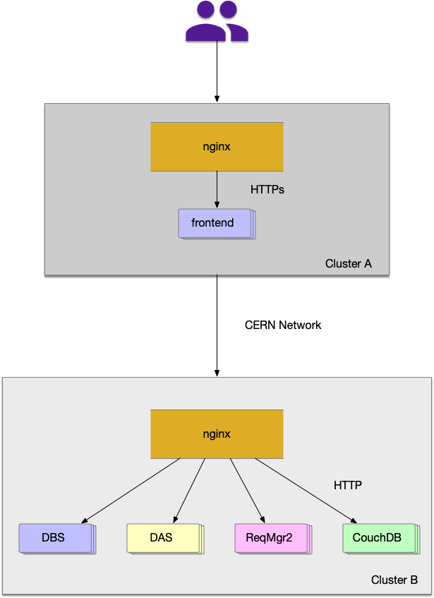

### cmsweb k8s architecture
The cmsweb k8s architecture has the two components, see diagram below:
- frontend cluster
- backend cluster

The frontend cluster contains cmsweb apache frontend behind nginx k8s ingress
controller (server), see Cluster A in a diagram. The backend cluster
contains all cmsweb back-end services behind its ingress controller.
The frontend cluster ingress controller provides TLS passthrough capabilities
to pass client's requests (with certificates) to apache frontend.
The apache frontend performs cmsweb authentication and redirects
request to backend cluster. On the backend cluster the ingress controller
has basic redirect rules to appropriate services and only allow
requests from frontend cluster.

### cmsweb k8s monitoring architecture
The cmsweb k8s monitoring architecture can be illustrated as following:

It has the following components:
- each individual services (running in its pod) may have a
  [filebeat](https://www.elastic.co/guide/en/beats/filebeat/current/filebeat-overview.html)
  light-weight process. This process scrape logs (chosen in its configuration)
  and send them upstream to logstash server
- [logstash](https://www.elastic.co/guide/en/logstash/current/index.html)
   service collects filebeats from individual services, process them
   accordingly, construct JSON records and pass them to upstream services, in
   our case to CERN MONIT infrastructure.
   - please note that it is possible to configure both filebeat and
   logstash to save data on local disk, etc.
   - the logstash data are feeded into CERN MONIT infrastrcuture
   and collected in [ElasticSearch](https://www.elastic.co/products/elastic-stack)
- [prometheus](https://prometheus.io/docs/introduction/overview/) service
  collect metrics from various cmsweb services
  - we run various exporters (processes) which expose metrics from a given
  data service. These exporters run on the same pod as a service.
  The prometheus data are exposed as data-source in CERN MONIT infrastructure.
- The data from ElasticSearch or Prometheus data-sources can be used in
  visualzation toolkits like
  [grafana](https://grafana.com) and [kibana](https://www.elastic.co/products/kibana).
