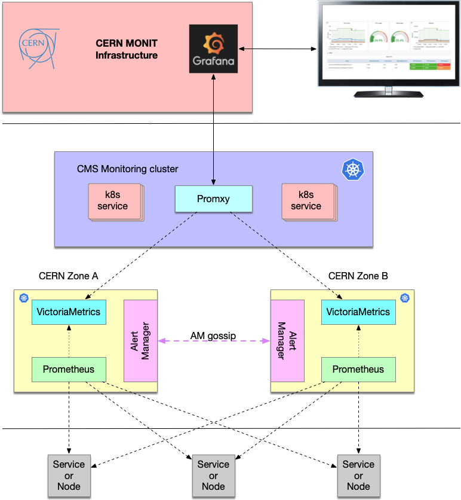

### CMS Monitoring HA documentation
This documentation provides all details for High-Availability (HA) mode 
of CMS monitoring infrastructure.



To achieve HA mode of operation we use the
following infrastructure setup:
- two kubernetes clusters (ultimately running in different CERN zones)
- [promxy](https://github.com/jacksontj/promxy) a prometheus proxy to unify
  access to Prometheus services
- each HA cluster (called `cms-monitoring-ha<N>`) contains the following stack
  of services:
  - [Prometheus](http://prometheus.io/) as a primary service to collect CMS
    metrics
  - [VictoriaMetrics](https://victoriametrics.github.io/) (VM) as backend service
  for Prometheus services
  - [AlertManager](https://www.prometheus.io/docs/alerting/latest/alertmanager/) (AM)
  as a service for Prometheus alerts
  - [httpgo](https://github.com/dmwm/CMSKubernetes/blob/master/kubernetes/monitoring/services/httpgo.yaml)
  a custom HTTP server to keep AlertManager messages
  - [kube-eagle](https://github.com/cloudworkz/kube-eagle) a prometheus
    exporter which exports various metrics of kubernetes pod resource requests,
    limits and it's actual usages.

The `promxy` provides an unified access to HA clusters and we configure it to
provide access to VM services. Then, the `promxy` service can be used in
Grafana to represent a data-source to our HA cluster.

We use the following port convention:
- 30090 points to 9090 port of Prometheus and exposed as NodePort on k8s
  infrastructure
- 30093 points to 9093 port of AM, it is default AM port
- 30094 points to 9094 port of AM, it is cluster's AM port for gossip protocol
- 30428 points to 8248 port of VM, it is VM HTTP port
- 30242 points to 4242 port of VM, it is Open TSDB VM port
Please note, the 30XXX-32XXX port range is allowed by k8s to be used as
NodePorts and be accessible outside of k8s cluster. Therefore we use convension
30000+last three digit of service's port number.

### configuration
To properly configure HA mesh we need the following steps:
- setup proper environment
```
# setup for HA1 cluster
export KUBECONFIG=/afs/cern.ch/user/v/valya/private/cmsweb/k8s_admin_config/config.monit/config.monitoring-vm-ha1
# setup for HA2 cluster
export KUBECONFIG=/afs/cern.ch/user/v/valya/private/cmsweb/k8s_admin_config/config.monit/config.monitoring-vm-ha2
```
- deploy VM in both clusters
```
kubectl apply -f services/ha/victoria-metrics.yaml
```
- deploy AM in both clusters with cluster peer mode (it is defined as an
  additional flag in AM yaml manifest)
```
# in HA1 cluster use alertmanager-ha1.yaml config
kubectl apply -f services/ha/alertmanager-ha1.yaml
# in HA2 cluster use alertmanager-ha2.yaml config
kubectl apply -f services/ha/alertmanager-ha2.yaml
```
- deploy Prometheus in both clusters with proper rules
```
# get list of prometheus rules create appropriate secret
files=`ls secrets/prometheus/*.json secrets/prometheus/*.rules secrets/prometheus/ha/prometheus.yaml | awk '{ORS=" "; print "--from-file="$1""}'`
ns=default
secret=prometheus-secrets
kubectl -n $ns delete secret $secret
kubectl create secret generic $secret $files --dry-run=client -o yaml | kubectl apply --namespace=$ns -f -

# deploy prometheus service
kubectl apply -f services/ha/prometheus.yaml
```
- deploy `services/ha/kube-eagle.yaml` to monitor our HA cluster
- deploy `services/ha/httpgo.yaml` to consume logs from Prometheus

At the end each HA cluster will have the following set of services:
```
# example of HA1 cluster pods
NAME                                READY   STATUS    RESTARTS   AGE
alertmanager-8464c9bb5f-665nc       1/1     Running   0          17m
httpgo-688cc578-fghhc               1/1     Running   0          20d
kube-eagle-79c84f6b6d-94zvl         1/1     Running   0          20d
prometheus-54c6b9545d-gknls         1/1     Running   0          8m28s
victoria-metrics-6cbbb74bbb-494h5   1/1     Running   0          20d

# example of HA1 cluster services
NAME               TYPE        CLUSTER-IP       EXTERNAL-IP   PORT(S)                         AGE
alertmanager       NodePort    10.254.44.243    <none>        9093:30093/TCP,9094:30094/TCP   19m
httpgo             NodePort    10.254.184.66    <none>        8888:30888/TCP                  20d
kube-eagle         ClusterIP   10.254.115.233   <none>        8080/TCP                        20d
kubernetes         ClusterIP   10.254.0.1       <none>        443/TCP                         20d
prometheus         NodePort    10.254.185.99    <none>        9090:30090/TCP                  20d
victoria-metrics   NodePort    10.254.182.246   <none>        8428:30428/TCP,4242:30242/TCP   20d
```


### References
[HA Prometheus+AM](https://www.robustperception.io/high-availability-prometheus-alerting-and-notification)
